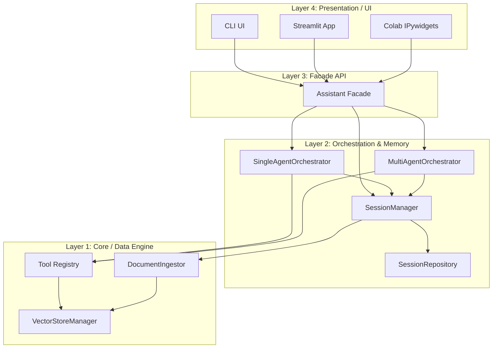

# AI Agent Document Assistant 🤖📄

Autonomous LLM-driven document assistant that leverages reasoning and specialized tools to interact with uploaded documents. Grounded in source material, it acts as a decision-maker—evaluating user intent, invoking appropriate search/summarization tools, and synthesizing cited responses.

It supports **hybrid orchestration modes** (Single-Agent ReAct or Multi-Agent Supervisor) and is designed to run **locally-first** using Ollama (e.g., `llama3.2:3b`) with cloud fallbacks (OpenAI).

---

## 🛠️ Tech Stack & Key Technologies

* **Core Language:** Python `3.11` to `3.12`
* **Dependency & Package Management:** [Poetry](https://python-poetry.org/)
* **Orchestration & Agents:** [LangChain](https://www.langchain.com/) (agent loops & tools) and [LangGraph](https://www.langchain.com/langgraph) (multi-agent state graphs, parallel map-reduce nodes)
* **Vector Database:** [ChromaDB](https://www.trychroma.com/) (storing high-dimensional vectors for semantic similarity searches)
* **Embedding Model:** `all-MiniLM-L6-v2` via HuggingFace sentence-transformers (running on GPU if CUDA/MPS is available, otherwise CPU)
* **LLM Engine:**
  * **Local:** [Ollama](https://ollama.com/) (default: `llama3.2:3b`, customizable)
  * **Cloud Fallback:** [OpenAI GPT-4o-mini](https://openai.com/)
* **User Interfaces:**
  * **Streamlit** (interactive dashboard with session controls, document filtering checkboxes, and token metrics)
  * **Command Line Interface (CLI)** (lightweight chat loop with `/commands`)
  * **Google Colab / Jupyter Widgets** (IPywidgets-based presentation workspace)

---

## 🏗️ System Architecture

The application is structured into four highly decoupled, modular layers:



### 1. Presentation Layer (UIs)
Exposes conversational views. Interfaces consume the system strictly via the unified facade API.
* **Streamlit (`streamlit_ui.py`):** Multi-column control panel for hot-swapping models, toggling between Single/Multi-agent modes, active document filtering, and token counters.
* **CLI (`cli.py`):** Interactive loop using slash commands (`/upload`, `/status`, `/models`, `/switch`).
* **Colab (`colab_ui.py`):** Custom dashboard utilizing HTML and IPython widgets.

### 2. Facade Layer (`assistant.py`)
The `Assistant` class exposes a clean, framework-agnostic API. It shields UIs from internal details of LangChain, LangGraph, and ChromaDB.

### 3. Orchestration & State Layer
* **Session Manager (`manager.py`):** Coordinates loading/saving states and routes document uploads to the ingestor.
* **Session Repository (`repository.py`):** Handles serialization of `SessionState` to static JSON files in `./data/sessions/`.
* **Single-Agent Engine (`single_agent.py`):** Implements a standard ReAct (Reasoning and Action) loop using tool-calling capabilities.
* **Multi-Agent Engine (`multi_agent.py`):** Implements a **Supervisor/Workers** architecture in LangGraph. The supervisor delegates tasks to specialized worker nodes:
  * **SearchAgent:** Focuses on retrieving raw facts and quotes using similarity searches.
  * **SummaryAgent:** Focuses on condensing large sections or documents.
  * **MetadataAgent:** Retrieves structural outline details.

### 4. Core ETL & Tooling Layer
* **Document Ingestor (`ingestor.py`):** Stateless pipeline. Loads files (`PDF`, `DOCX`, `TXT`, `MD`), extracts PDF bookmarked outlines (Table of Contents) and document authors, slices intro/conclusion ranges, splits text into overlapping chunks, and registers them.
* **Vector Store Manager (`vector_store.py`):** Controls Chroma DB connections and Embedding models. Implements **Lazy Loading** to conserve RAM.
* **Tool Registry (`registry.py`):** Factory compiling LangChain tools injected with system states.

---

## 🛠️ Specialized Agent Tools

The system provides specialized tools for document retrieval and structure analysis:

1. **`semantic_search`:** Queries Chroma DB using cosine similarity. It filters results based on session context and active document selection filters.
2. **`get_document_overview`:** Quickly retrieves cached header/conclusion boundaries of a file for high-level overviews.
3. **`summarize_specific_section`:** Performs deep, topic-specific similarity searches (fetching a dense chunk size, $K=15$) and delegates synthesis to the LLM.
4. **`get_document_metadata`:** Outputs active file names, formats, sizes, and vector chunk distribution.
5. **`get_table_of_contents`:** Retrieves the structural outline parsed from the PDF outline metadata.
6. **`generate_comprehensive_summary` (Under the Hood):** A LangGraph Map-Reduce summary tool. Splits documents, runs parallel map steps to summarize each chunk, and reduces them into a cohesive master summary.

---

## 📈 Observability & Logging

A custom callback pipeline tracks agent execution:
* **Token Tracking:** Tracks input and output tokens per LLM query, supporting Ollama's `response_metadata` and OpenAI's `usage_metadata`.
* **Audit Trails:** Logs raw thoughts, tool invocations, and vector chunk relevance in `./agent_audit.log`.

---

## 🚀 Environment Setup & Installation

### Prerequisites
* **Python:** `3.11.x` or `3.12.x`
* **Poetry:** Follow the [Poetry installation guide](https://python-poetry.org/docs/#installation).
* **Ollama:** Download and install [Ollama](https://ollama.com/) (required for local-first operations).

### Installation Steps

1. **Clone the Repository** (or enter the project folder):
   ```bash
   cd document_assistant
   ```

2. **Install Dependencies** using Poetry:
   ```bash
   poetry install
   ```
   *This automatically sets up a virtual environment and installs LangChain, LangGraph, ChromaDB, and Streamlit.*

3. **Start Ollama & Pull the Default LLM:**
   Make sure the Ollama desktop application is running, then pull the model:
   ```bash
   ollama pull llama3.2:3b
   ```
   *You can also pull other models, such as `llama3` or `qwen2.5`.*

4. **Set Up Fallback API Keys (Optional):**
   If you wish to use OpenAI model engines, set your API key environment variable:
   * **Windows (PowerShell):**
     ```powershell
     $env:OPENAI_API_KEY="your-api-key-here"
     ```
   * **Linux/macOS:**
     ```bash
     export OPENAI_API_KEY="your-api-key-here"
     ```

---

## 🎮 Running the Applications

### 1. Streamlit Interface (Dashboard)
Runs the unified UI where you can ingest documents, swap models, and switch orchestrator modes.
```bash
poetry run python src/document_assistant/ui/app.py ui
```
*(Alternatively: `poetry run streamlit run src/document_assistant/ui/streamlit_ui.py`)*

### 2. CLI Mode
A fast, lightweight shell client.
```bash
poetry run python src/document_assistant/ui/app.py cli
```
**CLI Commands:**
* `/upload <path>` - Ingest a document
* `/status` - Check active documents and chunks
* `/models` - Show downloaded local models
* `/switch <model>` - Hot-swap LLM engines (e.g. `/switch qwen2.5`)
* `/quit` - Close terminal

### 3. Google Colab / Notebook Mode
To run inside notebooks, refer to [Agent_Systems_Project_PoC.ipynb](proof_of_concept/Agent_Systems_Project_PoC.ipynb) or run:
```bash
poetry run python src/document_assistant/ui/colab_ui.py
```
*Note: The Jupyter notebook and `colab_ui.py` currently run in Single-Agent mode.*
